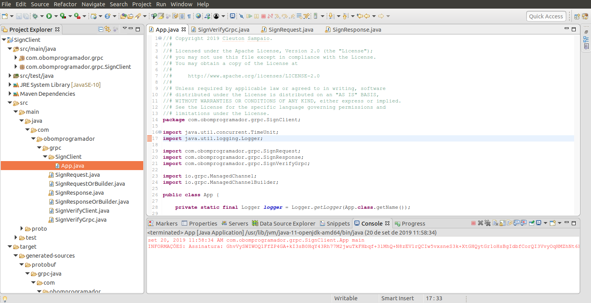

# Comunicação inter-services

Exemplo de comunicação entre micro serviços utilizando [**gRPC**](https://www.grpc.io/).

Todos os arquivos aqui gerados estão liberados sob a licença Apache 2.0.

**Cleuton Sampaio**.

[](https://www.lcm.com.br/site/#livros/busca?term=cleuton)

## Pré-requisitos para criar e rodar essa demonstração

- python 3.7
- Java 11
- OpenSSL
- Anaconda

Você deve ter algum JDK instalado. A parte Java deste exemplo, fiz com Java 11, mas, se preferir, pode adaptar para outra versão. O OpenSSL pode ser instalado desta forma: 
- [**MS Windows**](https://tecadmin.net/install-openssl-on-windows/)
- [**Linux**](https://www.howtoforge.com/tutorial/how-to-install-openssl-from-source-on-linux/)

O Anaconda deve ser baixado do [**site do projeto**](https://www.anaconda.com/distribution/) de acordo com a versão do seu sistema operacional.

Dentro da pasta raiz do projeto, há um [**arquivo YAML**](./conda-grpc-env.yml) para criar o ambiente virtual Anaconda para tranbalharmos. Crie e ative ambiente com os comandos: 

```
conda env create -f conda-grpc-env.yml
conda activate pygrpc
```

Lembre-se de ativar o ambiente sempre que abrir um novo Terminal ou console para trabalhar com Python e gRPC. 

## Compilando o protocolo

Os protocolos para os serviços demonstrados estão na pasta [**protos**](./protos) e podem ser compilados com o comando abaixo: 

```
python -m grpc_tools.protoc -I$INCLUDEDIR --python_out=$PYTHON_OUT --grpc_python_out=$GRPC_PYTHON_OUT $PROTOFILE
```

Onde: 
- $INCLUDEDIR: Pasta onde o protobuf procurará os includes para os arquivos de protocolo;
- $PYTHON_OUT: Pasta onde gravar os arquivos gerados
- $GRPC_PYTHON_OUT: Idem
- $PROTOFILE: Arquivo "proto" a ser utilizado

Se estiver na pasta raiz do projeto, o comando será assim:
```
python -m grpc_tools.protoc -I./protos --python_out=. --grpc_python_out=. protos/signature.proto
```
Este comando vai gerar os arquivos apropriados para o Serviço.

## Crie uma chave privada

Esta parte de assinatura digital foi baseada no [**Gist de Adam Cardenas**](https://gist.github.com/cevaris/e003cdeac4499d225f06).

Este serviço apenas "assina" digitalmente um texto, utilizando uma chave privada criada com OpenSSL. Portanto, você deve utilizar o OpenSSL para isto: 

```
openssl genrsa -out private_key.pem 1024
```
Salve o arquivo [**pem**] na pasta raiz do projeto. 


## Suba o Servidor Python

O [**servidor gRPC**](./signature_server.py) é fácil de usar. Se você clonou este repositório, abra a pasta raiz e digite: 

```
python signature_server.py
```

Teste com o cliente [**python**](./signature_client.py): 

```
python signature_client.py
```

O resultado deverá ser assim: 

```
Assinatura:  GhvVySWIWOQ1FfZP4GA+kI3sB0HqY43Rh77M2jwuTkFHbqf+3lMhQ+N8zEV1rQCIw5vxsneS3k+XtGHQytGr1oHsBgIdbfCorQI3VvyOqHMZhNt6PtTZU10mo7ZHyEQsZSPWPscUXzXLj6CiXWhPlFg9lSzYliNtfisloOY7JQ8=
```

É claro que os caracteres da assinatura mudarão, afinal, sua chave será diferente. 

## Criando um cliente Java

Na pasta [**Java**](./java) há um [**programa cliente feito em Java**](./java/src/main/java/com/obomprogramador/grpc/SignClient/App.java), que consome o serviço através de gRPC. Ele poderia ser outro micro serviço, por exemplo. 

O importante são as modificações no [**pom.xml**](./java/pom.xml). Eu utilizo um plugin para ler o arquivo [**proto**](./java/src/main/proto/signature.proto), que é o mesmo do projeto Python, e gerar automaticamente as classes para o consumo do serviço. Essas classes são geradas dentro da pasta **./java/target/generated sources**, no projeto, e devem ser copiadas para a pasta **./java/src/main/java/com/obomprogramador/grpc/**. Sempre que você alterar o arquivo **proto** rode um ```mvn clean package``` e copie as classes.

Eis o teste do Cliente Java: 



